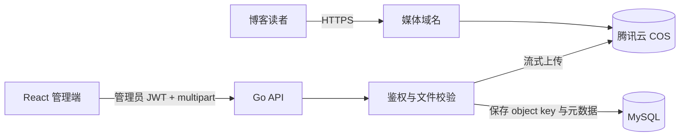

# ADR-0002：媒体存储与上传架构

- 状态：已接受
- 日期：2026-09-29
- 决策者：hxy
- 关联范围：MVP 图片上传、生产部署和灾难恢复

## 背景

博客 MVP 需要管理员上传图片并将其插入文章。系统运行在 2 vCPU、2 GiB 内存的单台腾讯云服务器上，并要求在 Sprint 1 前完成自动部署、健康检查和回滚验证。

如果图片只保存在服务器本机 Docker 卷中，容器更新不会丢失数据，但图片仍与单台服务器共享故障域；服务器磁盘损坏、实例误删或重建时必须依赖异机备份恢复。先使用本地卷、再迁移对象存储还会增加数据搬迁和 URL 兼容工作。

图片是公开内容，适合与应用运行时解耦。为减少后续迁移并让应用容器保持无状态，本项目需要在 MVP 阶段明确远程媒体存储边界。

## 问题与动机

本决策解决以下问题：

1. 应用发布、回滚或服务器重建时，已发布图片不能随容器或服务器状态丢失。
2. 图片 URL 必须稳定，不能把供应商域名或服务器文件路径写死在文章内容中。
3. COS 凭据不能暴露给 React 前端，上传入口必须受管理员鉴权和文件校验保护。
4. 方案应适合个人博客的小流量和 2C2G 资源约束，不提前引入浏览器直传、CDN 编排或图片处理流水线。

## 决策

MVP 采用以下方案：

- 使用**腾讯云 COS 标准存储**保存原始博客图片。
- React 使用 Axios 将 `multipart/form-data` 上传到 Go API，不直接访问 COS 写接口。
- Go API 完成管理员鉴权、文件校验和对象键生成后，以流式方式上传 COS。
- COS 对博客图片提供公开读取能力，写入和删除权限仅授予后端使用的最小权限身份。
- 通过项目自有的稳定媒体域名提供图片地址；COS 默认域名不写入文章正文或数据库业务字段。
- 数据库只保存供应商无关的对象键和图片元数据，不保存服务器绝对路径或带签名 URL。
- 上传成功后返回媒体资源 ID 和稳定 URL；文章引用媒体资源时必须填写替代文本。

## 范围

2026-10-10 后续范围变更：Sprint 6 在已完成的 MVP 基础上增加 BMP 和 GIF 上传，保留 GIF 原始动画；原有格式、COS 存储边界、媒体 URL 和单文件 10 MiB 限制不变。新增格式通过可回滚迁移进入媒体 MIME 白名单。下列“MVP 范围”记录初始交付时的决策，不代表 Sprint 6 后的完整格式清单。

### MVP 范围内

- JPG、PNG、WebP 图片上传。
- 单文件不超过 10 MiB；宽、高分别不超过 8192 像素，总像素不超过 2000 万。
- 服务端根据文件内容识别格式，不信任客户端扩展名和 `Content-Type`。
- MVP 不在 2C2G 服务器上重新编码图片；检测到 EXIF 元数据时拒绝上传，并提示管理员先在本地移除，避免位置等隐私信息被公开。
- 使用不可预测的对象键；原始文件名只作为可选展示信息，不参与存储路径。
- 保存 MIME 类型、字节数、宽高、校验和、对象键和创建时间。
- 文件级上传进度、失败原因和重试反馈。
- COS 请求结果和耗时的结构化日志与基础指标。

### MVP 范围外

- 浏览器通过预签名 URL 直传 COS。
- GIF、SVG、视频和任意附件上传。
- 图片裁剪、水印、自动多规格缩略图和格式批量转换。
- 独立媒体库、批量编辑和跨文章素材管理。
- CDN 多地域调度和多云复制。

## API 与数据契约

### 上传入口

`POST /api/admin/media`

- 认证：仅管理员可访问。
- 请求：`multipart/form-data`，文件字段为 `file`。
- 成功：返回 `201 Created`，包含媒体 ID、稳定 URL、MIME 类型、字节数、宽度和高度。
- 失败：使用明确的 4xx 错误区分未认证、格式不支持、文件过大和图片损坏；COS 不可用返回可重试的 5xx 错误。

### 媒体元数据

`media_assets` 至少包含：

| 字段 | 含义 |
| --- | --- |
| `id` | 媒体资源的稳定标识 |
| `object_key` | 与供应商无关的对象键，唯一 |
| `mime_type` | 服务端识别后的 MIME 类型 |
| `size_bytes` | 文件字节数 |
| `width` / `height` | 解码后的图片尺寸 |
| `checksum_sha256` | 完整性校验和 |
| `status` | `ready` 或 `failed` |
| `created_at` | UTC 创建时间 |

Schema 的精确类型和索引由首个媒体故事的 Goose 迁移确定，本 ADR 不替代数据库迁移。

## 安全边界

- COS SecretId、SecretKey 和临时凭据只通过生产环境密钥注入，不进入仓库、前端包、日志或 API 响应。
- COS 身份遵循最小权限，只能访问指定存储桶和项目对象前缀；禁止账户级管理权限。
- 所有写操作要求管理员鉴权，并配置文件大小限制、请求超时和频率限制。
- 同时检查文件签名和图片解码结果；MVP 禁止 SVG，避免脚本和外部资源注入。
- 对象键由服务端生成，禁止将用户文件名直接拼入路径，避免路径穿越、冲突和敏感信息泄露。
- 日志只记录媒体 ID、对象键、结果、大小和耗时，不记录凭据、JWT、Cookie 或预签名 URL。
- 媒体域名必须使用 HTTPS；安全响应头和防盗链策略在部署设计中统一配置。

## 一致性策略

COS 与 MySQL 不能共享事务，因此使用补偿策略：

1. Go API 校验文件并上传 COS。
2. COS 成功后写入 `media_assets`。
3. 数据库写入失败时，立即尝试删除刚上传的对象并记录补偿结果。
4. 补偿删除失败时保留可检索日志，后续清理无元数据对应的孤立对象。

删除媒体资源必须先确认没有已发布文章引用。MVP 不实现自动级联删除，避免误删导致文章破图。

## 测试策略

| 类型 | 关键场景 |
| --- | --- |
| 单元测试 | 对象键生成、格式/大小/尺寸校验、COS 错误映射和补偿分支 |
| Handler 测试 | 未登录、非法格式、超限、损坏图片和成功响应契约 |
| 集成测试 | 隔离测试桶中的上传、读取、校验和验证及清理 |
| 部署冒烟测试 | 管理员上传后，稳定媒体 URL 可通过 HTTPS 读取 |

测试数据不得使用生产存储桶。集成测试对象使用独立前缀，并在测试结束后清理。

## 监控与可观测性

至少记录以下指标：

- 上传请求数，以及按成功、校验失败、COS 失败分类的结果数。
- 上传总耗时和 COS 请求耗时。
- 上传字节数和拒绝的超限文件数。
- 补偿删除失败数；出现任何一次都需要人工检查孤立对象。

连续上传失败、COS 鉴权失败或补偿删除失败必须产生明确日志。不得把原始文件内容写入日志。

## 回滚与故障处理

- 应用部署回滚只切换 Go/React 镜像版本，不修改或删除 COS 对象。
- 新版本上传失败时，停止新的图片上传并回滚应用；既有图片读取不受影响。
- 若 COS 暂时不可用，文章正文仍可访问，但图片可能加载失败；MVP 不引入本地双写或缓存作为降级方案。
- Schema 变更必须提供 Goose down 迁移；只有确认新版本未写入不兼容数据时才执行回退。
- 回滚和故障排查过程不得清空存储桶或批量删除媒体对象。

## 未来迁移策略

如果未来更换对象存储供应商：

1. 保持现有对象键不变，将对象复制到新存储。
2. 对比对象数量、大小和 SHA-256 校验和。
3. 先灰度验证新媒体域名的读取，再切换 DNS 或媒体基础地址。
4. 观察无误后再停止旧存储写入，并在保留期结束后下线旧存储。

因为文章引用稳定媒体域名且数据库只保存对象键，迁移不需要批量改写文章正文。

## 依赖与实施计划

### 外部依赖

- 正式媒体桶使用腾讯云 COS `hxy-blog-media-1497610660`，地域为 `ap-nanjing`；不得复用私有备份桶 `hxy-blog-backup-1497610660`。
- 具备最小对象权限的腾讯云 CAM 身份。
- 正式媒体域名为 `media.hxy2333.site`；仅在 ICP 备案通过并配置 TLS 后启用。
- 经许可证和资源开销评审后的官方 Go SDK。

### 实施阶段

| 阶段 | 交付物 | 验证方式 |
| --- | --- | --- |
| 1. 云资源准备 | 存储桶、CAM 策略、媒体域名 | 人工确认权限边界和 HTTPS 读取 |
| 2. 后端能力 | 上传服务、元数据迁移、管理员 API | 单元测试、Handler 测试、隔离桶集成测试 |
| 3. 前端能力 | Axios 上传、进度、错误和替代文本交互 | 组件测试和人工验收 |
| 4. 生产验证 | 上传冒烟测试、指标和故障回滚 | CD 后健康检查与回滚演练 |

每个阶段必须拆成 1–2 天内可验收的任务，不在同一 PR 中同时完成云资源、后端和前端全部实现。

## 风险

| 风险 | 影响 | 概率 | 缓解措施 |
| --- | --- | --- | --- |
| COS 凭据泄露 | 高 | 低 | 最小权限、密钥隔离、日志脱敏和定期轮换 |
| COS 或网络不可用 | 中 | 低 | 明确超时和重试边界；保留既有文章文本访问能力 |
| COS 与数据库状态不一致 | 中 | 中 | 补偿删除、校验和及孤立对象审计 |
| 对象存储费用异常 | 中 | 低 | 限制上传大小、监控存储/流量并配置预算告警 |
| 供应商锁定 | 中 | 低 | 仅保存对象键、使用稳定媒体域名并保留迁移校验流程 |

## 备选方案

### 本机 Docker 持久化卷

优点是实现最简单且无外部 API。缺点是与应用服务器共享故障域，还必须建立异机备份和恢复演练。考虑到项目已要求生产 CD 和灾难恢复闭环，未选择该方案。

### 浏览器预签名直传 COS

可减少 Go API 的带宽和连接占用，但需要处理临时凭据、CORS、上传完成确认和更复杂的客户端状态。当前图片体量较小，推迟到上传流量对 2C2G 服务器造成可观测压力时再评估。

### 自建 MinIO

提供对象存储接口，但在同一台 2C2G 服务器上仍无法消除单机故障域，并增加内存、升级和备份负担，因此不采用。

## 后果

正面影响：应用容器可以无状态部署和回滚；图片脱离单机故障域；未来更换存储时不需要改写文章内容。

负面影响：新增腾讯云账号权限、外部网络依赖和按量费用；开发和测试需要隔离的 COS 配置；Go API 中转上传会占用服务器带宽。

## 已关闭的实施参数

- 媒体桶为 `hxy-blog-media-1497610660`，地域为 `ap-nanjing`，与数据库备份桶隔离。
- 正式媒体域名为 `media.hxy2333.site`；备案完成前仅允许本地开发和受控测试，不向公网提供媒体服务。
- 单文件上限为 10 MiB，单边上限为 8192 像素，总像素上限为 2000 万；检测到 EXIF 时拒绝上传，不在服务器重新编码。
- 对象键不可预测且禁止覆盖，因此 MVP 关闭版本控制；正式媒体对象不设置自动过期。
- 生命周期规则在 1 天后终止未完成的分片上传，并在 7 天后删除 `tmp/` 前缀对象；`media/` 正式对象只能通过应用补偿或人工审计删除。
- COS 权限采用公开读取、私有写入，禁止列举存储桶；后端 CAM 身份只拥有指定桶和前缀所需的上传、读取与补偿删除权限。
- 腾讯云费用中心设置每月 20 元预算，达到 50%、80% 和 100% 时通知管理员；超过预算不自动删除媒体。

图片上传故事开始前仍需创建并核验上述云资源，但不再需要重新决定名称、地域、安全边界或图片限制。
