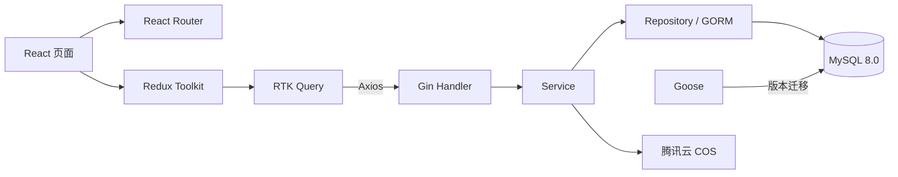

# ADR-0003：应用技术栈与内容模型

- 状态：已接受
- 日期：2026-09-29
- 决策者：hxy
- 关联范围：MVP 后端、前端、数据访问和文章内容

## 背景

项目需要在 2 vCPU、2 GiB 内存的单台服务器上运行个人博客，并由一人配合 AI 持续开发。技术栈需要兼顾开发效率、清晰边界、测试能力和较低的生产资源占用。

ADR-0001 已确定 Go 模块化单体、React SPA、MySQL 和 Docker Compose 的总体方向，但尚未记录 HTTP 框架、ORM、迁移工具、前端路由、HTTP 客户端、状态管理和文章内容格式。若这些选择只保留在对话中，后续 AI 或开发者容易引入重复工具和不一致的实现模式。

## 问题与目标

本决策解决以下问题：

1. 为 HTTP、业务、数据访问和数据库迁移建立清晰但不过度抽象的边界。
2. 让 React SPA 的路由、请求、客户端状态和服务器状态各有唯一职责。
3. 使用可长期保存、可导出且不绑定特定编辑器的文章格式。
4. 在增加依赖的同时控制二进制、浏览器包和运行时资源成本。

## 决策

### 后端

- 语言与运行时：Go 1.25。
- HTTP 框架：Gin。
- 数据访问：GORM，业务代码不直接拼接 SQL。
- Schema 迁移：Goose，使用可排序且具备 up/down 的版本迁移。
- 数据库：MySQL 8.0，字符集使用 `utf8mb4`，存储引擎使用 InnoDB。
- 架构：模块化单体，Handler 只负责 HTTP 协议转换，业务规则位于 Service，持久化逻辑位于 Repository。
- 日志：优先使用 Go 标准库 `log/slog` 输出结构化日志。

GORM 的 `AutoMigrate` 不用于生产 Schema 管理。生产和 CI 只接受已进入版本控制的 Goose 迁移。

### 前端

- React + TypeScript + Vite，构建为静态 SPA。
- React Router 负责浏览器路由；生产反向代理必须把未知前端路径回退到 `index.html`。
- Axios 是唯一 HTTP 客户端，由统一实例处理 API 基础地址、超时、错误结构和认证头。
- Redux 使用 Redux Toolkit，不直接使用传统 `createStore` 和手写 action type。
- RTK Query 管理 API 请求、缓存、失效和请求状态，通过 Axios 自定义 `baseQuery` 发起请求。
- 普通 Redux slice 只保存真正的客户端全局状态，例如内存中的 Access JWT、主题和跨页面编辑状态。
- 组件本地状态保留在组件内；可推导状态不写入 Redux。
- 不引入 TanStack Query，避免同时维护两套服务器状态缓存。

### UI 与样式

- 以 `doc/design/visual-design-manual.html` 为视觉规范。
- 使用 CSS 变量承载语义设计令牌，并按实际页面需求创建少量项目组件。
- MVP 不引入重量级 UI 组件框架，不为尚未出现的页面预建通用组件库。

### 文章内容

- MySQL 保存 Markdown 源文，字段语义为 `content_markdown`。
- 支持 GitHub Flavored Markdown。
- React 使用 `react-markdown` 渲染，使用 `remark-gfm` 扩展语法，并使用 `rehype-sanitize` 清洗输出。
- Markdown 源文是唯一事实来源，不在数据库中同时保存长期有效的渲染 HTML。
- 管理端提供 Markdown 编辑与实时预览；MVP 不引入 WYSIWYG 富文本编辑器。
- 图片引用使用稳定的项目媒体域名，具体存储方案遵循 ADR-0002。

## 架构边界

### 后端职责

| 层 | 职责 | 禁止事项 |
| --- | --- | --- |
| Handler | 参数解析、认证上下文、响应与错误映射 | 编写业务规则或直接访问数据库 |
| Service | 业务规则、事务边界、外部服务协调 | 依赖 Gin 上下文或 HTTP 类型 |
| Repository | GORM 查询和持久化语义 | 吞掉数据库错误或返回 HTTP 状态码 |
| Migration | Schema 的版本化 up/down 变更 | 依赖应用启动时自动改表 |

只在存在真实替代实现或测试边界时定义接口，不为每个结构体机械创建接口。

### 前端状态边界

| 状态类型 | 所属位置 | 示例 |
| --- | --- | --- |
| 服务器状态 | RTK Query | 文章列表、文章详情、当前管理员信息 |
| 全局客户端状态 | Redux slice | 内存 Access JWT、主题、未发布编辑状态 |
| URL 状态 | React Router | slug、分页、筛选条件 |
| 局部交互状态 | React 组件 | 对话框开关、输入焦点、单个表单字段 |

Redux 持久化插件不进入 MVP。Access JWT、上传文件对象和临时预览 URL 不写入 LocalStorage、SessionStorage 或持久化 Redux。

## 内容安全

- Markdown 渲染必须经过允许列表清洗，不允许直接使用 React 的 `dangerouslySetInnerHTML` 渲染用户内容。
- MVP 不允许文章嵌入任意原始 HTML、脚本、iframe 或 SVG。
- 外部链接需要安全的 `rel` 属性；是否默认新窗口打开由 UI 规范统一决定。
- 代码块、链接和图片的自定义渲染组件必须保留语义 HTML 和键盘可访问性。
- API 对文章内容设置明确大小上限，拒绝无界请求体。

## API 与错误约定

- API 统一使用 `/api` 前缀，JSON 字段使用 `camelCase`。
- Axios 与 RTK Query 共享一个错误模型，至少包含稳定错误码和用户可理解的消息。
- API 时间使用 UTC RFC 3339；列表接口必须分页并设置最大页大小。
- 前端只根据稳定错误码决定交互，不解析后端自由文本。
- 取消请求和页面切换产生的中止不展示为系统错误。

## 数据迁移约定

- 每次 Schema 变更必须由独立 Goose 迁移完成，并提供可验证的 down 路径。
- GORM Model 用于运行时数据映射，不作为 Schema 的唯一事实来源。
- 迁移在新应用版本接管流量前执行；失败时停止部署，不启动不兼容版本。
- 破坏性变更采用先扩展、后迁移、再收缩的多阶段方式，不在单次部署中同时删除旧字段和发布依赖新结构的代码。

## 测试策略

| 类型 | 范围 |
| --- | --- |
| Go 单元测试 | Service 业务规则、错误分支和纯函数 |
| Handler 测试 | Gin 路由、输入验证、认证和响应契约 |
| MySQL 集成测试 | GORM 查询、事务、唯一约束和 MySQL 方言行为 |
| 前端单元/组件测试 | Redux reducer、RTK Query 错误映射和关键组件状态 |
| 端到端测试 | 文章阅读、登录、编辑、发布和图片上传关键路径 |

新增依赖前必须说明必要性、许可证和运行成本。依赖版本由实现故事确定并写入锁文件，本文不固定易过期的具体版本号。

## 监控与可观测性

- Gin 请求日志至少包含请求 ID、方法、路径模板、状态码和耗时，不记录 Token、Cookie 或文章正文。
- 数据库记录连接池使用情况和慢查询线索；初始最大连接数遵循 ADR-0001。
- 前端错误至少区分网络失败、认证失败、输入错误和服务端错误。
- Markdown 渲染异常、迁移失败和外部 COS 错误必须可从结构化日志定位。

## 回滚策略

- 前端静态资源和 Go 镜像以不可变版本发布，回滚时切换到上一版本。
- Goose 迁移必须在发布前验证 up/down；包含数据写入的迁移不得仅因应用回滚而自动执行 down。
- 新旧版本需在迁移窗口内保持向后兼容，确保应用回滚不会立即遇到缺失字段。
- Markdown 源文保持向后兼容；扩展语法不得使旧版本渲染器崩溃。

## 风险

| 风险 | 影响 | 概率 | 缓解措施 |
| --- | --- | --- | --- |
| Gin/GORM 边界混乱 | 中 | 中 | Handler、Service、Repository 职责检查和评审 |
| GORM 行为与 MySQL 方言不一致 | 高 | 中 | 真实 MySQL 集成测试，禁止只用内存数据库验证 |
| Axios 与 RTK Query 职责重复 | 中 | 中 | Axios 只做传输，缓存与请求生命周期只由 RTK Query 管理 |
| Markdown XSS | 高 | 低 | 禁止原始 HTML并使用 `rehype-sanitize` 允许列表 |
| SPA 首屏和 SEO 能力有限 | 中 | 中 | MVP 接受该取舍，监测实际需求后再评估预渲染或 SSR |
| 前端依赖体积增长 | 中 | 中 | 路由级懒加载、构建产物检查和依赖必要性评审 |

## 备选方案

### Go 标准库路由代替 Gin

依赖更少，但项目已选择 Gin 以统一中间件、参数绑定和团队开发体验。Gin 只停留在 HTTP 边界，避免框架类型向业务层扩散。

### 手写 SQL 或只使用 GORM AutoMigrate

手写 SQL控制力更强，但会增加当前 CRUD 场景的样板代码；AutoMigrate 简单但不适合作为可审计、可回滚的生产迁移工具。因此选择 GORM 负责运行时数据访问、Goose 负责版本迁移。

### 原始 Redux 或 TanStack Query

原始 Redux 会产生更多样板代码；TanStack Query 本身成熟，但与用户已选 Redux 的 RTK Query 重叠。项目只保留 Redux Toolkit 和 RTK Query。

### 富文本编辑器或存储 HTML

富文本编辑体验更直观，但会引入复杂依赖、编辑器私有数据结构和 HTML 清洗压力。Markdown 更适合个人技术博客的代码、表格和版本管理需求。

## 实施计划

| 阶段 | 交付物 | 验证方式 |
| --- | --- | --- |
| 1. 基础依赖 | Gin、GORM、Goose、React Router、Axios、Redux Toolkit | 锁文件审查和 `task check` |
| 2. 数据边界 | MySQL 连接、迁移命令和 Repository 骨架 | 真实 MySQL 集成测试 |
| 3. 前端边界 | Router、Store、Axios baseQuery 和错误模型 | 单元测试与生产构建 |
| 4. 内容链路 | Markdown 编辑、预览和安全渲染 | XSS 用例与端到端测试 |

每个阶段必须由具体用户故事驱动，禁止一次性搭建没有业务调用方的通用层。

## 后果

正面影响：前后端边界统一；数据库变更可审计；Redux 与 Axios 不会形成重复缓存；Markdown 内容可长期迁移和导出。

负面影响：相较标准库方案增加多项依赖；SPA 的首屏 SEO 能力弱于 SSR；RTK Query 接入 Axios 需要维护少量适配代码。

## 参考

- [Gin 文档](https://gin-gonic.com/en/docs/)
- [GORM 文档](https://gorm.io/docs/)
- [Goose](https://github.com/pressly/goose)
- [Redux Toolkit](https://redux.js.org/introduction/why-rtk-is-redux-today)
- [React Router SPA](https://reactrouter.com/how-to/spa)
- [react-markdown](https://github.com/remarkjs/react-markdown)
