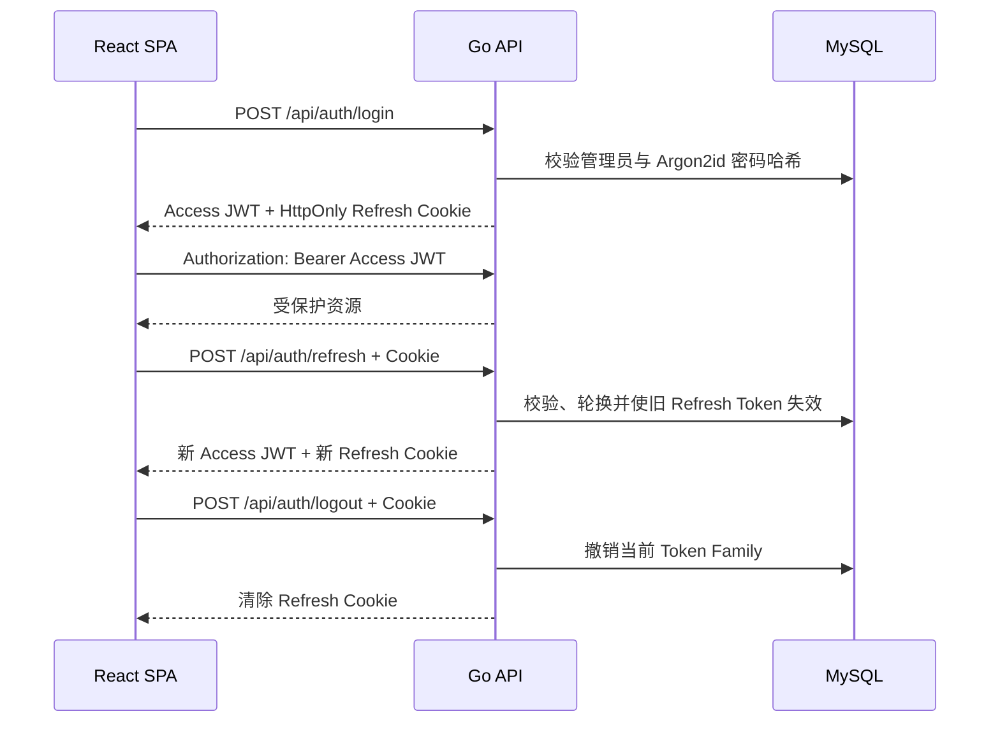

# ADR-0004：管理员鉴权与会话策略

- 状态：已接受
- 日期：2026-09-29
- 决策者：hxy
- 关联范围：单管理员登录、管理端 API 和会话安全

## 背景

MVP 只有一名管理员，但创建、编辑、发布文章和上传图片都属于高权限操作。React SPA 需要在不把长期凭据暴露给 JavaScript 持久化存储的前提下维持登录状态，同时支持主动退出、令牌轮换和凭据泄露后的撤销。

项目已选择 JWT，但单个长期 JWT 难以安全撤销；把 Token 存入 LocalStorage 还会扩大 XSS 后的凭据泄露影响。因此需要区分短期 API 访问凭据和长期会话凭据。

## 决策

采用“短期 Access JWT + 轮换 Refresh Token Cookie”方案：

- Access Token 使用 JWT，有效期固定为 10 分钟。
- Access JWT 仅保存在 React/Redux 内存中，通过 `Authorization: Bearer` 发送；页面刷新后不持久化。
- Refresh Token 使用高熵随机不透明值，不使用长期 JWT。
- Refresh Token 只通过 `Secure`、`HttpOnly`、适当 `SameSite` 的 Cookie 传输。
- MySQL 只保存 Refresh Token 的密码学哈希、Token Family、过期时间、撤销时间和轮换关系，不保存明文。
- 每次刷新都轮换 Refresh Token；旧 Token 再次出现时视为重放，撤销整个 Token Family。
- 管理员密码使用 Argon2id 哈希；数据库不保存明文密码或可逆密文。
- MVP 只有一个管理员账户，不引入 OAuth、RBAC 或多租户权限模型。

会话参数固定为：Refresh Token 每次签发后 7 天过期，会话从首次登录起最多持续 30 天；轮换后的过期时间取“当前时间加 7 天”和会话绝对过期时间中的较早值。

## 会话流程

页面首次加载时，前端可以调用刷新入口恢复内存中的 Access JWT。刷新失败时清空认证状态并进入未登录页面，不进行无限重试。

## API 契约

| Endpoint | 方法 | 说明 | 认证要求 |
| --- | --- | --- | --- |
| `/api/auth/login` | POST | 校验管理员凭据并创建会话 | 无 |
| `/api/auth/refresh` | POST | 轮换 Refresh Token 并返回新 Access JWT | Refresh Cookie |
| `/api/auth/logout` | POST | 撤销当前会话并清除 Cookie | Refresh Cookie |
| `/api/auth/me` | GET | 返回当前管理员最小公开信息 | Access JWT |

登录失败统一返回相同错误，不暴露用户名是否存在。认证 API 的响应和日志不得包含 Refresh Token。

## JWT 约束

- 签名算法固定为 `HS256`；密钥至少包含 32 字节密码学随机数据，并以密钥 ID 区分当前和上一把密钥。
- 只接受明确配置的签名算法，拒绝 `none` 或算法降级。
- 必须验证签名、`exp`、`iat`、`iss`、`aud` 和唯一令牌标识。
- JWT Claim 只包含授权所需最少信息，不放入密码哈希、邮箱等不必要数据。
- 签名密钥只通过生产密钥注入，具备明确轮换策略；不得写入仓库或日志。
- Access JWT 过期只通过 Refresh 流程续期，不静默延长旧 Token。
- `iss` 固定为 `hxy-blog`，`aud` 固定为 `hxy-blog-admin`，允许的时钟偏差最多为 30 秒。
- 签名密钥每 90 天轮换一次；签发只使用当前密钥，上一把密钥最多额外保留 11 分钟用于验证已签发的 Access JWT。发生泄露时立即轮换，不等待周期到期。

具体 JWT 库在实现故事中选择，必须支持严格算法限制和完整 Claim 校验。

## Refresh Token 数据

会话记录至少包含：

| 字段 | 含义 |
| --- | --- |
| `id` | 会话记录标识 |
| `token_hash` | Refresh Token 的密码学哈希，唯一 |
| `family_id` | 同一登录会话的轮换家族 |
| `parent_id` | 上一个 Token，用于识别轮换链 |
| `expires_at` | 绝对过期时间 |
| `used_at` | 首次轮换使用时间 |
| `revoked_at` | 撤销时间 |
| `created_at` | 创建时间 |

过期和撤销记录按保留策略清理。精确字段类型由 Goose 迁移确定。

## Cookie 与 CSRF

- 生产环境前端与 API 同源部署在 `https://hxy2333.site`，API 使用 `/api` 前缀，不拆分 API 子域名。
- Refresh Cookie 名称固定为 `__Secure-hxy_refresh`，启用 `Secure`、`HttpOnly` 和 `SameSite=Strict`，省略 `Domain` 以保持 Host-only，`Path=/api/auth`。
- Refresh 和 Logout 除 Cookie 外还必须校验 `Origin`/`Referer` 是否属于允许的站点。
- 生产环境同源请求不启用 CORS；本地开发只允许配置中明确列出的 `http://127.0.0.1:5173` 和 `http://localhost:5173`，禁止带凭据请求使用通配符来源。
- Access JWT 使用请求头发送，不依赖 Cookie，因此普通管理 API 不使用 Cookie 作为授权依据。
- 备案通过并启用 HTTPS 前，不在公网 IP 的明文 HTTP 上开放生产登录；本地开发若关闭 `Secure` 必须使用独立的非生产配置。

## 密码与登录保护

- 密码使用 Argon2id，参数固定为内存 64 MiB、迭代 3 次、并行度 1、16 字节随机盐和 32 字节输出，并使用 PHC 字符串保存算法与参数。
- 2026-09-30 在目标 2C2G 服务器实测该参数平均约 120 ms；API 同时最多执行两个密码哈希，避免 256 MiB 容器因恶意并发耗尽内存。
- 登录接口按来源和账户实施频率限制，并记录失败计数，不记录输入密码。
- 管理员初始密码不得写入镜像、迁移或仓库；通过一次性生产配置安全注入。
- 修改密码、轮换签名密钥或发现 Refresh Token 重放时撤销所有相关会话。

## 前端边界

- Redux 只保存内存 Access JWT 和最小认证状态。
- 禁止把 Access JWT、Refresh Token、Cookie 或密码写入 LocalStorage、SessionStorage、Redux 持久化、错误上报或日志。
- Axios 请求拦截器负责添加当前 Access JWT；响应刷新只能由单一协调逻辑执行，避免多个 401 同时触发刷新风暴。
- 自动刷新最多重试一次；再次失败立即登出，不能循环刷新。
- 管理页面路由守卫只改善用户体验，真正的授权必须由 Go API 执行。

## 测试策略

| 类型 | 关键场景 |
| --- | --- |
| 单元测试 | JWT Claim/算法校验、Token 哈希、轮换和家族撤销 |
| Handler 测试 | 登录成功/失败、Cookie 属性、过期 Token、Origin 拒绝和登出 |
| MySQL 集成测试 | Token 唯一约束、并发轮换、重放检测和事务回滚 |
| 前端测试 | 内存 Token、单次刷新协调、刷新失败登出和不持久化验证 |
| 端到端测试 | 登录、页面刷新恢复、Access 过期续期、主动退出和重放撤销 |

安全测试必须覆盖伪造签名、错误算法、错误 issuer/audience、过期时间和被撤销会话。

## 监控与审计

记录但不包含敏感值：

- 登录成功、失败和频率限制触发次数。
- Refresh 成功、失败、过期和重放检测次数。
- Token Family 撤销和管理员主动退出事件。
- 认证接口状态码、耗时和来源 IP 的最小必要信息。

任何 Refresh Token 重放检测都应产生高优先级安全日志。连续登录失败达到阈值时应告警或触发临时限制。

## 回滚与密钥轮换

- 应用回滚不得恢复已撤销或已轮换的 Refresh Token。
- 数据库迁移必须在新旧应用版本间保持会话表兼容，避免回滚后绕过重放检测。
- JWT 签名密钥轮换期间允许短暂同时验证当前和上一把公钥/密钥标识，签发只使用新密钥。
- 发生密钥泄露时立即替换签名密钥、撤销全部 Refresh Token，并要求管理员重新登录。
- 鉴权异常无法快速修复时回滚应用镜像；不得通过关闭鉴权恢复服务。

## 风险

| 风险 | 影响 | 概率 | 缓解措施 |
| --- | --- | --- | --- |
| JWT 签名密钥泄露 | 高 | 低 | 密钥隔离、轮换和全量会话撤销预案 |
| XSS 窃取 Access JWT | 高 | 低 | 不持久化、Markdown 清洗、CSP 和短有效期 |
| CSRF 利用 Refresh Cookie | 高 | 低 | SameSite、Origin 校验和严格 CORS |
| 并发刷新导致误判重放 | 中 | 中 | 单次刷新协调、数据库事务和短暂并发容忍设计 |
| Argon2id 参数超过 2C2G 能力 | 中 | 中 | 在目标服务器基准测试并限制登录并发 |
| Token 表持续增长 | 低 | 中 | 定期清理过期且超过审计保留期的记录 |

## 备选方案

### 单个长期 JWT

实现简单，但难以撤销且泄露窗口长，不满足生产会话安全要求。

### Access JWT 存入 LocalStorage

页面刷新后恢复方便，但任何成功执行的 XSS 都可以直接读取并带走 Token，因此不采用。

### 纯服务端 Session Cookie

对单体应用同样可行，撤销简单；但用户已确认 JWT，且短期 Access JWT 能保持 API 授权边界清晰。本方案仍把长期会话状态保存在服务端，而不是追求完全无状态。

### 长期 Refresh JWT

减少数据库查询，但轮换、重放检测和精确撤销更复杂。使用不透明随机 Token 与数据库状态更适合单管理员项目。

## 实施计划

| 阶段 | 交付物 | 验证方式 |
| --- | --- | --- |
| 1. 数据基础 | 管理员和 Refresh Token Goose 迁移 | up/down 与真实 MySQL 集成测试 |
| 2. 后端认证 | 密码校验、JWT、登录/刷新/退出 API | Handler 与安全测试 |
| 3. 前端会话 | Redux 内存状态、Axios 注入和单次刷新协调 | 前端单元测试与页面刷新测试 |
| 4. 生产加固 | Cookie、CORS、Origin、限流、密钥轮换 | 端到端测试和安全检查清单 |

鉴权属于高风险变更，每个实现 PR 必须人工评审，不与文章 CRUD 或图片上传混在同一 PR。

## 后果

正面影响：长期凭据不暴露给 JavaScript；会话可以撤销并检测重放；Access JWT 泄露窗口受限。

负面影响：需要维护 Refresh Token 状态和轮换事务；前端需要协调 401 刷新；本方案并非完全无状态 JWT。

## 已关闭的实施参数

- Access JWT 10 分钟，Refresh Token 7 天，会话绝对有效期 30 天。
- JWT 使用 `HS256` 和至少 32 字节随机密钥，90 天定期轮换，并严格校验算法、签发方和受众。
- Argon2id 使用 64 MiB、3 次迭代、单线程；目标服务器基准约 120 ms。
- 生产环境使用 `https://hxy2333.site` 同源承载 SPA 与 `/api`，Refresh Cookie 使用 Host-only、`Secure`、`HttpOnly` 和 `SameSite=Strict`。

实现故事仍需通过安全测试验证这些参数，但不再需要重新做架构选择。

## 参考

- [OWASP Password Storage Cheat Sheet](https://cheatsheetseries.owasp.org/cheatsheets/Password_Storage_Cheat_Sheet.html)
- [RFC 8725：JSON Web Token Best Current Practices](https://www.rfc-editor.org/rfc/rfc8725.html)
- [MDN：Secure cookie configuration](https://developer.mozilla.org/en-US/docs/Web/Security/Practical_implementation_guides/Cookies)
