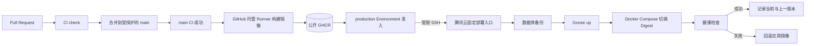

# ADR-0005：生产持续交付架构

- 状态：已接受
- 日期：2026-09-29
- 决策者：hxy
- 技术负责人：hxy
- 关联范围：镜像构建、生产部署、数据库迁移、健康检查和回滚

## 背景

项目托管在公开 GitHub 仓库，生产环境为一台 2 vCPU、2 GiB 内存的腾讯云 Ubuntu 服务器，并通过 `ssh tencent` 管理。服务器已经安装 Docker 与 Docker Compose，但当前没有应用容器、持久化卷或占用 80/443 端口的服务。`main` 已启用分支保护，Pull Request 必须通过 CI 后才能合并。

生产域名为 `hxy2333.site`，目前仍在 ICP 备案中。备案完成前可以准备部署目录、容器、内部健康检查和流水线，但不得通过域名或公网 IP 对外开放网站。项目需要在 Sprint 1 前建立可审计、可重复且可回滚的交付链路，避免把个人开发电脑或生产服务器变成不可复现的构建环境。

## 问题与动机

本决策解决以下问题：

1. 确保生产镜像来自已通过 CI 的 `main` 提交，并能追溯到唯一 Git Commit。
2. 避免在 2C2G 生产服务器上拉取源码、安装构建依赖或执行前端编译。
3. 明确 Goose 迁移、应用切换、健康检查和失败回滚的顺序，降低发布造成数据损坏的风险。
4. 限制 GitHub Actions 对服务器的权限，防止部署凭据演变为任意 root 远程执行能力。
5. 在 ICP 备案期间完成内部验证，同时确保网站不会提前提供公网访问。

## 范围

### 本阶段范围内

- GitHub 托管 Runner 构建 Linux AMD64 的 API 与 Web 镜像。
- GHCR 保存版本化生产镜像，生产部署锁定不可变的 Commit SHA 和镜像 Digest。
- GitHub `production` Environment 管理部署准入和 SSH 凭据。
- 服务器通过 Docker Compose 运行反向代理、React 静态站点、Go API 和 MySQL。
- 部署前数据库备份、Goose 迁移、内部/外部健康检查、应用镜像自动回滚。
- 将 SCP 镜像包作为 GHCR 不可用时的应急恢复路径。
- 备案完成前后的公网启用边界和域名规划。

### 本阶段范围外

- Kubernetes、多节点部署、蓝绿集群和自动扩缩容。
- 在生产服务器运行 GitHub Self-hosted Runner。
- 在生产服务器拉取源码或构建镜像。
- 数据库 Schema 的无人值守自动 down migration。
- 多环境集群、完整 APM 平台和 7×24 值班体系。
- 自动签发或公开启用正式 TLS；该动作必须等待备案和 DNS 条件满足。

## 决策

### 镜像仓库与构建

- 使用 GitHub Container Registry（GHCR）作为正式镜像仓库。
- API 镜像命名为 `ghcr.io/hxy2321548628/hxy-blog-api`，Web 镜像命名为 `ghcr.io/hxy2321548628/hxy-blog-web`。
- 镜像设置为公开读取。生产服务器无需保存 GHCR 长期访问令牌；任何运行时密钥都不得进入镜像层。
- GitHub 托管 Runner 构建 `linux/amd64` 镜像；生产服务器不安装 Go、Node.js 或源码构建依赖。
- 每次发布生成 Commit SHA 标签并记录镜像 Digest。部署以 Digest 为最终身份，不以可变的 `latest` 标签决定生产版本。
- 镜像元数据至少包含源码仓库、Commit SHA 和构建时间，便于审计和定位。

公开源码不代表镜像可以包含公开配置。数据库密码、JWT 密钥、COS 凭据和管理员初始凭据只在服务器运行时注入，禁止通过 Docker `ARG`、`ENV`、构建日志或前端产物写入镜像。

### 交付链路



只有满足以下条件的提交可以进入部署阶段：

1. 提交位于受保护的 `main` 分支。
2. 与该提交对应的 `check` 已成功。
3. 镜像构建与推送均成功，且得到两个镜像的不可变 Digest。
4. `production` Environment 的准入规则已满足。

同一时间最多执行一个生产部署。新部署不得在旧部署仍运行时并发修改 Compose 状态或数据库 Schema。

### GitHub 与服务器权限边界

- 发布镜像的 Job 只获得读取仓库和写入 Packages 所需的最小权限。
- 部署凭据只存在于 GitHub `production` Environment，不提供给 Pull Request 工作流。
- GitHub Secrets 至少包括部署用户名、SSH 私钥、端口和服务器 Host Key；连接时必须校验固定 Host Key，禁止关闭主机校验。
- 生产服务器使用独立的低权限部署用户，不复用日常登录账户。
- 部署用户只能调用由 root 管理的固定部署入口，以及完成该入口所需的最小 Docker 权限；不能通过流水线获得任意 root Shell。
- 数据库、JWT、COS 等应用密钥仅保存在服务器受限文件中，GitHub Actions 不读取这些值。
- 公开仓库不使用生产服务器作为 Self-hosted Runner，避免来自不可信 Pull Request 的代码接触内网和生产凭据。

### 服务器运行结构

```text
Internet（备案完成后）
    |
TLS reverse proxy :443
    |-- /api/*  --> Go API
    `-- /*      --> React 静态站点

Go API --> MySQL 持久化卷
Go API --> 腾讯云 COS
```

- 应用部署目录和服务器密钥目录分离；部署包可读不代表可以读取生产密钥。
- MySQL 使用 Docker 持久化卷；应用容器保持无状态。
- 容器配置日志轮转和合理资源上限，避免单个服务耗尽 2 GiB 内存或服务器磁盘。
- React SPA 的未知页面路径回退到 `index.html`，`/api` 路径不得进入前端回退逻辑。
- V1 为单实例替换发布，接受容器切换期间的短暂不可用；不为个人博客提前引入双实例流量编排。

反向代理和 MySQL 必须使用用户已确认的现有镜像。具体镜像名称、版本或 Digest 未确认前，不在 Compose 文件中猜测或写死。

### 域名与备案期行为

- `hxy2333.site` 作为主站规范域名。
- `www.hxy2333.site` 在正式开放后永久重定向到主站。
- `media.hxy2333.site` 指向腾讯云 COS，遵循 ADR-0002。
- ICP 备案完成前，不解析或不放通能够使网站通过公网域名/IP访问的 80/443 服务。
- 备案期只允许通过服务器本机回环地址或 SSH 隧道验证部署和健康检查。
- 备案完成后，单独执行 DNS、TLS、公网防火墙和 80/443 开放清单；未通过 HTTPS 验证不得宣布上线。

### 数据库备份与迁移顺序

每次可能包含数据库变化的发布遵循以下顺序：

1. 记录当前 API/Web 镜像 Digest、迁移版本和发布时间。
2. 创建带时间和发布 ID 的 MySQL 逻辑备份，并验证备份命令成功、文件非空。
3. 使用即将发布的版本执行 Goose `up`。
4. 迁移失败时立即停止发布，保持旧应用运行，不切换镜像。
5. 迁移成功后切换 API/Web 镜像并等待 Readiness 成功。
6. 健康检查通过后记录新版本，同时保留上一个可用版本的 Digest。

数据库变更遵循“先扩展、再迁移、后收缩”。应用回滚时不自动执行 Goose `down`；只有人工确认没有新版本写入的不兼容数据，并验证备份可恢复后，才能单独决定 Schema 或数据回退。

正式公网开放前必须具备异机数据库备份和恢复演练。异地备份已在 ADR-0006 中确认为腾讯云 COS、SSE-COS AES-256 和 90 天保留。Lighthouse 使用仅启用编程访问的专用 CAM 子用户，密钥只保存在服务器 root 专用配置中。

### 健康检查契约

- API Liveness 只证明进程能够响应，不依赖 MySQL 或 COS。
- API Readiness 至少验证应用初始化完成且 MySQL 可用，不因 COS 短时故障判定整个博客不可读。
- Web 健康检查验证静态入口可读取；正式上线后还要验证主域名 HTTPS 首页和 API Readiness。
- 健康响应只返回最小状态和版本标识，不暴露连接串、环境变量、依赖地址或堆栈。
- 备案期使用容器网络或服务器回环地址检查；备案完成后增加公网 HTTPS 冒烟检查。

新版本在限定时间内持续未就绪、容器反复重启，或首页/API 冒烟检查失败，均视为部署失败并触发应用镜像回滚。

## 安全考虑

- Pull Request 工作流没有 Packages 写权限、生产 Environment 访问权或 SSH 密钥。
- 第三方 GitHub Actions 使用可信来源，并在实现时固定到完整 Commit SHA，降低供应链漂移风险。
- 构建上下文通过 `.dockerignore` 排除 `.git`、本地环境文件、缓存和测试密钥。
- 部署日志可以记录发布 ID、Commit SHA、镜像 Digest、迁移版本和检查结果，但不得输出密码、Token、Cookie、私钥或完整连接串。
- SSH 私钥使用专用部署密钥，可以独立轮换和撤销；不得复用个人日常登录私钥。
- 生产环境文件按最小权限读取，不挂载到 React Web 容器，也不进入前端构建参数。
- GHCR 或 GitHub Actions 发生异常时，流水线默认停止，不绕过 CI 或改为服务器临时构建。

## 测试与验收策略

| 类型 | 验收场景 |
| --- | --- |
| 工作流静态检查 | YAML 可解析、权限最小化、仅允许受保护的 `main` 触发生产部署 |
| 镜像测试 | API/Web 镜像可在 `linux/amd64` 启动，镜像不包含仓库密钥或本地环境文件 |
| Compose 测试 | MySQL 健康后 API 才进入 Ready，SPA 回退和 `/api` 路由正确 |
| 迁移测试 | 空库执行 Goose up，最新库执行 up 幂等检查，down 在隔离数据库验证 |
| 部署演练 | 首次部署成功并记录 Digest，重复部署同一版本结果可预测 |
| 回滚演练 | 故意部署健康检查失败的版本，系统自动恢复上一应用 Digest |
| 恢复演练 | 从备份恢复到隔离 MySQL，并校验迁移版本和关键数据 |
| 备案期检查 | 公网 80/443 不提供网站，本机或 SSH 隧道健康检查成功 |

CD 被视为完成必须同时满足：构建、推送、部署、健康检查、应用回滚和备份恢复均有可重复证据。只看到 GitHub Actions 绿色不等于完成回滚和恢复验证。

## 监控与可观测性

至少保留以下信息：

- GitHub 发布运行状态、触发 Commit、审批人和失败阶段。
- 服务器发布 ID、当前/上一版本 Digest、Goose 版本和部署耗时。
- API/Web/MySQL 容器健康状态、重启次数和最近错误日志。
- 内部与公网健康检查结果；公网检查仅在备案完成并正式开放后启用。
- 备份创建结果、文件大小、异机复制结果和最近一次恢复演练时间。

部署失败、迁移失败、回滚失败或备份失败必须使流水线失败并留下明确日志。MVP 可以先依赖 GitHub 通知和服务器结构化日志，不提前部署重量级监控栈。

## 回滚计划

| 触发条件 | 自动动作 | 人工后续 |
| --- | --- | --- |
| 镜像拉取失败 | 停止发布，保留当前版本 | 检查 GHCR/网络，可使用已验证的 SCP 应急包 |
| Goose up 失败 | 停止发布，不切换应用 | 检查迁移与备份，不自动执行 down |
| 新容器未就绪 | 恢复上一 API/Web Digest | 检查容器日志和迁移兼容性 |
| HTTPS 冒烟失败 | 恢复上一应用 Digest | 检查反向代理、证书和 DNS |
| 数据损坏迹象 | 停止自动操作并隔离写入 | 人工评估是否从备份恢复 |

应用回滚成功后仍要确认旧版本与当前数据库 Schema 兼容。若回滚本身失败，禁止继续自动重试迁移或清理数据，转为人工故障处理。

## 应急 SCP 路径

SCP 不是日常发布方式，只在 GHCR 长时间不可用且必须恢复服务时使用：

1. 从已通过 CI 的同一 Commit 获取或重新生成 `linux/amd64` 镜像包。
2. 生成并核对 SHA-256 校验和，镜像包与校验文件一同传输。
3. 服务器校验后导入本地 Docker，并继续使用同一个固定部署入口。
4. 部署记录标明来源、Commit SHA、镜像 Digest 和应急原因。

应急路径不得使用开发目录中的未提交代码，也不得绕过数据库备份、迁移检查和健康检查。

## 实施计划

| 阶段 | 交付物 | 验证方式 |
| --- | --- | --- |
| 1. 镜像基线 | API/Web Dockerfile、`.dockerignore`、本地 Compose | 本地构建、启动和 `make check` |
| 2. 发布流水线 | GHCR 构建推送、SHA/Digest 记录、production Environment | 测试提交生成可追溯镜像 |
| 3. 服务器入口 | 受限部署用户、固定部署入口、生产 Compose 与密钥目录 | 权限审计和重复部署演练 |
| 4. 数据安全 | 部署前备份、Goose 门禁、异机备份和恢复脚本 | 隔离数据库恢复演练 |
| 5. 故障闭环 | 健康检查、自动应用回滚、SCP 应急流程 | 注入失败版本并恢复上一版本 |
| 6. 正式开放 | DNS、TLS、防火墙、HTTPS 冒烟检查 | 备案完成后执行上线清单 |

每个阶段独立提交 Pull Request。服务器初始化和 GitHub Environment 配置属于高风险操作，必须保留执行清单和验证输出，不与业务功能 PR 混合。

## 风险

| 风险 | 影响 | 概率 | 缓解措施 |
| --- | --- | --- | --- |
| GHCR 在服务器侧暂时不可达 | 高 | 低到中 | 保留上一镜像、设置合理超时并提供校验过的 SCP 应急路径 |
| 部署 SSH 密钥泄露 | 高 | 低 | 专用密钥、Environment 隔离、Host Key 固定和服务器最小权限 |
| 数据库迁移与旧应用不兼容 | 高 | 中 | 扩展/收缩迁移、先备份、先迁移后切换且不自动 down |
| 2C2G 发布时资源不足 | 高 | 中 | 构建移出生产机、串行部署、资源限制和健康检查 |
| 公共镜像误含密钥 | 高 | 低 | 构建上下文排除、镜像扫描和运行时密钥注入 |
| 备案完成前误开放网站 | 高 | 低 | 防火墙/DNS 上线门禁，备案期只做回环或 SSH 隧道验证 |
| 单机磁盘或实例故障 | 高 | 低到中 | MySQL/COS 解耦、异机备份与定期恢复演练 |

## 备选方案

### 本地构建后通过 SCP 上传

实现直观，但发布依赖个人电脑状态，难以确保工作区干净、构建环境一致和镜像可审计；每次通常还要传输完整镜像包。因此只保留为应急恢复方案。

### GitHub Actions 构建后通过 SCP 上传

能够消除个人电脑差异，但仍要传输完整镜像包，并需要自行维护镜像版本、缓存和清理。相比 GHCR 没有明显收益，只有在镜像仓库长期不可用时才重新评估。

### 服务器拉取 Git 仓库并构建

会占用有限的 CPU、内存和磁盘，引入 Go/Node 构建依赖；服务器访问 GitHub 页面也可能不稳定。因此不采用。

### 生产服务器运行 Self-hosted Runner

可以省去 SSH 跳转，但公开仓库的工作流代码会靠近生产网络和凭据，攻击面过大。因此不采用。

### 私有 GHCR 镜像

可以限制镜像读取，但生产服务器必须长期保存 `read:packages` Token。当前源码本身公开，公开镜像配合严格的运行时密钥隔离更简单；未来若镜像包含不可公开的授权组件，再切换为私有包。

## 后果

正面影响：发布物可追溯且可复现；生产服务器负担较低；应用镜像能够快速回滚；GitHub 与服务器的密钥边界清晰；备案期也能完成大部分部署验证。

负面影响：依赖 GitHub Actions 和 GHCR；需要维护受限部署入口、备份和恢复演练；单实例发布仍可能产生短暂中断；数据库回退无法完全自动化。

## 已关闭的实施参数

- MySQL 使用 `mysql:8.0@sha256:7dcddc01f13bab2f15cde676d44d01f61fc9f99fe7785e86196dfc07d358ae2b`；Go、Alpine、Node 和 Nginx 构建/运行镜像均在各 Dockerfile 中固定 Digest。
- 生产目录为 `/opt/hxy-blog`，专用部署用户为 `hxy-deploy`，SSH 端口为 `22`；个人用户 `ubuntu` 不作为流水线部署身份。
- GitHub `production` Environment 每次部署都要求人工批准，只有受保护的 `main` 可以触发。
- 正式站点使用 `hxy2333.site`，媒体使用 `media.hxy2333.site`。ICP 备案通过前不得通过公网域名或公网 IP 提供网站访问，只允许服务器回环地址和 SSH 隧道验证。
- 备案完成日期、DNS 生效时间、TLS 证书和公安备案属于正式开放阶段的外部门禁，不阻塞 Sprint 0 工程基线，也不得在备案完成前提前执行。

Sprint 0 的构建、推送、部署、健康检查、自动应用回滚、COS 异地备份和隔离库恢复均已完成验证，证据记录在 [`Sprint 0 验收记录`](../engineering/sprint-0-acceptance.md)。

## 参考

- [GitHub Container Registry](https://docs.github.com/en/packages/working-with-a-github-packages-registry/working-with-the-container-registry)
- [使用 GitHub Actions 发布 Docker 镜像](https://docs.github.com/en/actions/tutorials/publish-packages/publish-docker-images)
- [GitHub 部署 Environment](https://docs.github.com/en/actions/concepts/workflows-and-actions/deployment-environments)
- [Self-hosted Runner 访问控制](https://docs.github.com/en/actions/how-tos/manage-runners/self-hosted-runners/manage-access)
- [Docker Compose 启动顺序与健康检查](https://docs.docker.com/compose/how-tos/startup-order/)
- [腾讯云 ICP 备案说明](https://cloud.tencent.com/document/product/243/18910)
